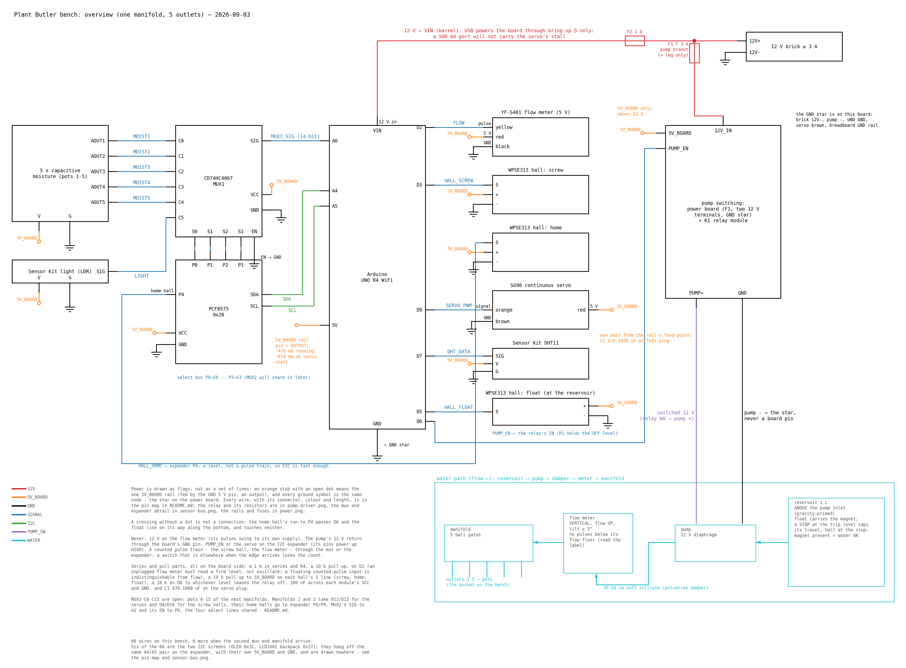
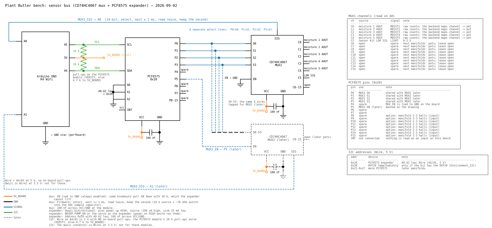
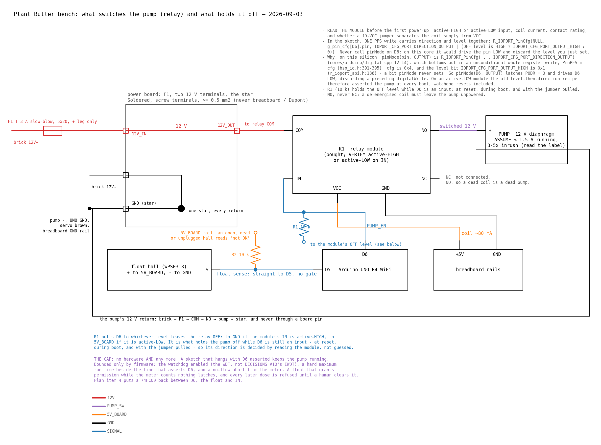
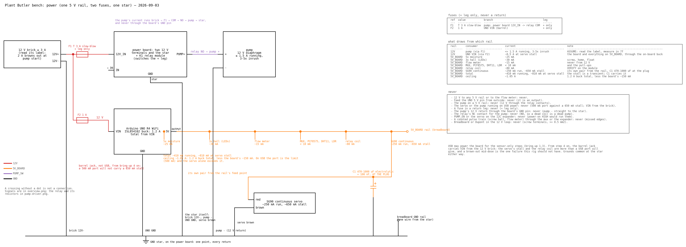

<!-- generated by gen_readme.py from nets.py (2026-09-03); edit those, not this file -->
# Bench wiring: one manifold, five pots — 2026-09-03

Wiring drawings and pin map to bench ONE manifold (5 outlets) with 5 soil-moisture sensors, the Sensor Kit temperature and light modules, two I2C screens (OLED 0x3C, LCD1602 backpack 0x27), an analog mux and an I2C expander (so more manifolds bolt on without rewiring), the pump with its relay, the inline flow meter, the float hall, the manifold's servo and its screw and home halls. No PCB, no enclosure; KiCad comes once the bench has fixed the part choices. Source of truth: [`nets.py`](nets.py) (every wire, every table); the drawings and this file are generated from it.

## Binding rules

From the umbrella [DECISIONS.md](../../DECISIONS.md) #5 and #7 and the pitches "Bench rig" and "Don't flood the flat":

- The pump never touches a 5 V rail: 12 V through relay contacts, its return straight to the star (DECISIONS #7). The servo does run off the board's 5 V, which the R4's buck can carry — see Power.
- The pump is OFF unless the MCU actively asserts D6: an MCU in reset, a floating pin, a boot, an unpowered relay coil, a pulled jumper and a lost 12 V all mean pump off, in hardware.
- The float is a sense pin only (D5). There is no hardware interlock on this bench: read THE GAP under Pump driver before trusting the tank to a sketch.
- Failure direction is dry: NAS or WiFi down, unknown manifold position, float says empty -> no watering (DECISIONS #5). The backend decides when to water; the firmware only enforces caps.
- Firmware side of the bench: hall pulse counting on the lead screw plus a home hall (polled), flow sanity from the meter, sensors reported raw as (controller, channel) counts.
- 12 V loop on a soldered perfboard with screw terminals and >= 0.5 mm2 wire; breadboard and Dupont only for 5 V logic.



*overview.png* — every used UNO pin labelled; one orange 5 V rail, and the pump's purple leg is 12 V out of the relay, never a GND; the screw hall and the flow meter land on interrupt pins while the home hall goes through the expander; the hydraulic strip along the bottom has the reservoir above the pump inlet.

## Pin map

Pins are inputs with pull-ups off at reset; D0/D1 stay free for serial; D6 gets its direction and the relay's OFF level in one PFS register write, because `pinMode(D6, OUTPUT)` on this core drives the pin LOW and would discard a level set before it (see the relay notes). `Wire` (A4/A5) is 5 V with no on-board pull-ups and carries the expander and both screens; the Qwiic connector is `Wire1` at 3.3 V and is not used.

| board pin | signal | module | module pin | series / pull | connector | wire colour | cable / note |
| --- | --- | --- | --- | --- | --- | --- | --- |
| D2 | FLOW | YF-S401 flow meter | yellow (pulse) | 1 k series at the board, 10 k pull-up to 5V_BOARD (R4) | 3-wire lead red / black / yellow | blue | <= 1 m; away from the servo lead; interrupt pin: pulses are counted, never muxed |
| D3 | HALL_SCREW | WPSE313 hall: screw pulse | S | 10 k pull-up to 5V_BOARD at the breadboard | 3-pin S / + (middle) / - | blue | <= 50 cm; hall fixed, magnet on the screw; interrupt pin: a missed edge is lost position |
| D5 | HALL_FLOAT | WPSE313 hall: float (tank) | S | 10 k pull-up to 5V_BOARD at the breadboard (R2) | 3-pin S / + (middle) / - plug: the one pulled in bring-up 5b | blue | to the reservoir, <= 1 m; direct pin, NOT the expander: shortest path for the safety input |
| D6 | PUMP_EN | 1-channel relay module K1 | IN | 10 k to the module's OFF level (R1): pull-down if active-HIGH, pull-up to 5V_BOARD if active-LOW | Dupont | blue | <= 30 cm; the jumper pulled in bring-up 4c |
| D7 | DHT_DATA | Sensor Kit temp/humidity (DHT11) | SIG |  | Grove 4-pin (VCC, GND, SIG, NC) | blue | Grove 20-50 cm; direct pin: us-level one-wire timing cannot cross a mux or the expander. Free if the kit has the DHT20 (I2C) |
| D9 | SERVO_PWM | SG90 continuous servo | orange (signal) |  | JR 3-pin brown / red / orange | blue | servo lead ~25 cm; direct pin: a servo needs its 50 Hz train unbroken (PCA9685 to expand) |
| A0 | MUX1_SIG | CD74HC4067 mux MUX1 | SIG |  | header / Dupont | blue | <= 20 cm; analog, 14-bit |
| A4 | SDA | PCF8575 I2C expander 0x20 | SDA | ONE set of pull-ups for the whole bus: 4.7 k to 5V_BOARD (VERIFY each module; remove the rest) | header / Dupont | green | <= 20 cm |
| A5 | SCL | PCF8575 I2C expander 0x20 | SCL | ONE set of pull-ups for the whole bus: 4.7 k to 5V_BOARD (VERIFY each module; remove the rest) | header / Dupont | green | <= 20 cm |
| A4/A5 | SDA + SCL | Sensor Kit OLED SSD1306 0x3C | SDA / SCL | ONE set of pull-ups for the whole bus: 4.7 k to 5V_BOARD (VERIFY each module; remove the rest) | Grove 4-pin (VCC, GND, SIG, NC) | green | Grove 20-50 cm; the same two wires as the expander: A4/A5 are a bus, not a pin each |
| A4/A5 | SDA + SCL | LCD1602 + PCF8574 backpack 0x27 | SDA / SCL | ONE set of pull-ups for the whole bus: 4.7 k to 5V_BOARD (VERIFY each module; remove the rest) | header / Dupont | green | <= 30 cm; shares the bus with the expander and the OLED |
| 5V | 5V_BOARD | 5V_BOARD rail (breadboard) | + |  | header / Dupont | orange | <= 20 cm; OUTPUT only, never fed. The board's buck gives 1.2 A total from VIN: see POWER_BUDGET |
| GND | GND | GND star (power board) | GND |  | screw terminal | black | <= 30 cm; the pump's 12 V return never passes here |
| VIN (barrel) | 12V | 12 V >= 3 A brick | 12V+ | 1 A fuse F2, + leg only | barrel 5.5/2.1 mm, centre + | red | the servo and the relay coil come out of this: do NOT run them on USB power (500 mA port) |
| A1 (later) | MUX2_SIG | CD74HC4067 mux MUX2 (later) | SIG |  |  | blue |  |

Free pins and what they are earmarked for:

| pin | use |
| --- | --- |
| D0 / D1 | serial: keep free |
| D4 | HALL_SCREW manifold 2 (later; freed when the home hall moved to the expander) |
| D8 | free |
| D10 | HALL_SCREW manifold 3 (later) |
| D11 | free |
| D12 | SERVO_PWM manifold 2 (later) |
| D13 | SERVO_PWM manifold 3 (later) |
| A1 | MUX2 SIG (later) |
| A2 | free (analog) |
| A3 | free (analog) |

Per manifold (manifold 1 is the bench):

| manifold | servo PWM | screw hall | home hall | mux SIG |
| --- | --- | --- | --- | --- |
| 1 (bench) | D9 | D3 | P4 (expander) | A0 (MUX1) |
| 2 (later) | D12 | D4 | P8 (expander) | A1 (MUX2) |
| 3 (later) | D13 | D10 | P9 (expander) | A1 (MUX2, C6-C15) |

What scales where, by signal type, not by habit: analog and slow (moisture, light) on the mux, 16 a piece; a level and slow (home hall, and the one float) on the expander or a spare pin; a counted pulse train (screw hall, flow meter) on an interrupt pin, because a mux is a switch and an edge missed while it sits on another channel is lost cart position. Past three manifolds, route the screw halls through a 74HC4051 into one interrupt pin (only one manifold moves at a time) and the servos onto a PCA9685 (16 channels of hardware PWM over I2C, its own 5 V supply) rather than spending a board pin each.

<details>
<summary>Every wire: 72 rows, 66 on the bench, 6 later (dashed on the drawings)</summary>

Module ids used below:

| id | module | status |
| --- | --- | --- |
| UNO | Arduino UNO R4 WiFi | in hand |
| PCF8575 | PCF8575 I2C expander 0x20 | in hand |
| MUX1 | CD74HC4067 mux MUX1 | in hand |
| MUX2 | CD74HC4067 mux MUX2 (later) | later |
| MOIST1 | moisture 1 (capacitive) | in hand |
| MOIST2 | moisture 2 (capacitive) | in hand |
| MOIST3 | moisture 3 (capacitive) | in hand |
| MOIST4 | moisture 4 (capacitive) | in hand |
| MOIST5 | moisture 5 (capacitive) | in hand |
| LDR | Sensor Kit light (LDR) | in hand |
| DHT | Sensor Kit temp/humidity (DHT11) | in hand |
| OLED | Sensor Kit OLED SSD1306 0x3C | in hand |
| LCD | LCD1602 + PCF8574 backpack 0x27 | in hand |
| SERVO | SG90 continuous servo | in hand |
| HALL_SCREW | WPSE313 hall: screw pulse | in hand |
| HALL_HOME | WPSE313 hall: home | in hand |
| HALL_FLOAT | WPSE313 hall: float (tank) | in hand |
| FLOW | YF-S401 flow meter | ASSUME |
| RELAY | 1-channel relay module K1 | in hand |
| PERFBOARD | power board: F1, 12 V terminals, GND star | bench |
| PUMP | 12 V diaphragm pump | ASSUME |
| BRICK | 12 V >= 3 A brick | ASSUME |
| RAIL5V | 5V_BOARD rail (breadboard) | bench |
| RAILGND | GND rail (breadboard) | bench |
| STAR | GND star (power board) | bench |

| from | pin | to | pin | net | colour | series / pull | connector | cable / note | when |
| --- | --- | --- | --- | --- | --- | --- | --- | --- | --- |
| UNO | D2 | FLOW | yellow (pulse) | SIGNAL | blue | 1 k series at the board, 10 k pull-up to 5V_BOARD (R4) | 3-wire lead red / black / yellow | <= 1 m; away from the servo lead; interrupt pin: pulses are counted, never muxed | bench |
| UNO | D3 | HALL_SCREW | S | SIGNAL | blue | 10 k pull-up to 5V_BOARD at the breadboard | 3-pin S / + (middle) / - | <= 50 cm; hall fixed, magnet on the screw; interrupt pin: a missed edge is lost position | bench |
| UNO | D5 | HALL_FLOAT | S | SIGNAL | blue | 10 k pull-up to 5V_BOARD at the breadboard (R2) | 3-pin S / + (middle) / - plug: the one pulled in bring-up 5b | to the reservoir, <= 1 m; direct pin, NOT the expander: shortest path for the safety input | bench |
| UNO | D6 | RELAY | IN | SIGNAL | blue | 10 k to the module's OFF level (R1): pull-down if active-HIGH, pull-up to 5V_BOARD if active-LOW | Dupont | <= 30 cm; the jumper pulled in bring-up 4c | bench |
| UNO | D7 | DHT | SIG | SIGNAL | blue |  | Grove 4-pin (VCC, GND, SIG, NC) | Grove 20-50 cm; direct pin: us-level one-wire timing cannot cross a mux or the expander. Free if the kit has the DHT20 (I2C) | bench |
| UNO | D9 | SERVO | orange (signal) | SIGNAL | blue |  | JR 3-pin brown / red / orange | servo lead ~25 cm; direct pin: a servo needs its 50 Hz train unbroken (PCA9685 to expand) | bench |
| UNO | A0 | MUX1 | SIG | SIGNAL | blue |  | header / Dupont | <= 20 cm; analog, 14-bit | bench |
| UNO | A4 | PCF8575 | SDA | I2C | green | ONE set of pull-ups for the whole bus: 4.7 k to 5V_BOARD (VERIFY each module; remove the rest) | header / Dupont | <= 20 cm | bench |
| UNO | A5 | PCF8575 | SCL | I2C | green | ONE set of pull-ups for the whole bus: 4.7 k to 5V_BOARD (VERIFY each module; remove the rest) | header / Dupont | <= 20 cm | bench |
| UNO | A4/A5 | OLED | SDA / SCL | I2C | green | ONE set of pull-ups for the whole bus: 4.7 k to 5V_BOARD (VERIFY each module; remove the rest) | Grove 4-pin (VCC, GND, SIG, NC) | Grove 20-50 cm; the same two wires as the expander: A4/A5 are a bus, not a pin each | bench |
| UNO | A4/A5 | LCD | SDA / SCL | I2C | green | ONE set of pull-ups for the whole bus: 4.7 k to 5V_BOARD (VERIFY each module; remove the rest) | header / Dupont | <= 30 cm; shares the bus with the expander and the OLED | bench |
| UNO | 5V | RAIL5V | + | 5V_BOARD | orange |  | header / Dupont | <= 20 cm; OUTPUT only, never fed. The board's buck gives 1.2 A total from VIN: see POWER_BUDGET | bench |
| UNO | GND | STAR | GND | GND | black |  | screw terminal | <= 30 cm; the pump's 12 V return never passes here | bench |
| BRICK | 12V+ | UNO | VIN (barrel) | 12V | red | 1 A fuse F2, + leg only | barrel 5.5/2.1 mm, centre + | the servo and the relay coil come out of this: do NOT run them on USB power (500 mA port) | bench |
| RAIL5V | + | MUX1 | VCC | 5V_BOARD | orange | 100 nF at the module |  |  | bench |
| RAIL5V | + | PCF8575 | VCC | 5V_BOARD | orange | 100 nF at the module |  |  | bench |
| RAIL5V | + | HALL_SCREW | + (middle) | 5V_BOARD | orange |  | 3-pin S / + (middle) / - |  | bench |
| RAIL5V | + | HALL_HOME | + (middle) | 5V_BOARD | orange |  | 3-pin S / + (middle) / - |  | bench |
| RAIL5V | + | HALL_FLOAT | + (middle) | 5V_BOARD | orange |  | 3-pin S / + (middle) / - |  | bench |
| RAIL5V | + | FLOW | red | 5V_BOARD | orange |  |  | 5V_BOARD ONLY, never 12 V: the pulses swing to the supply | bench |
| RAIL5V | + | DHT | VCC | 5V_BOARD | orange |  | Grove 4-pin (VCC, GND, SIG, NC) |  | bench |
| RAIL5V | + | LDR | VCC | 5V_BOARD | orange |  | Grove 4-pin (VCC, GND, SIG, NC) |  | bench |
| RAIL5V | + | OLED | VCC | 5V_BOARD | orange |  | Grove 4-pin (VCC, GND, SIG, NC) |  | bench |
| RAIL5V | + | LCD | VCC | 5V_BOARD | orange |  | Dupont | the backlight is most of the ~60 mA the two screens draw | bench |
| RAIL5V | + | MOIST1 | VCC | 5V_BOARD | orange |  | JST-PH 2.0 3-pin (VCC, GND, AOUT) | lead + extension <= 1.5 m | bench |
| RAIL5V | + | MOIST2 | VCC | 5V_BOARD | orange |  | JST-PH 2.0 3-pin (VCC, GND, AOUT) | lead + extension <= 1.5 m | bench |
| RAIL5V | + | MOIST3 | VCC | 5V_BOARD | orange |  | JST-PH 2.0 3-pin (VCC, GND, AOUT) | lead + extension <= 1.5 m | bench |
| RAIL5V | + | MOIST4 | VCC | 5V_BOARD | orange |  | JST-PH 2.0 3-pin (VCC, GND, AOUT) | lead + extension <= 1.5 m | bench |
| RAIL5V | + | MOIST5 | VCC | 5V_BOARD | orange |  | JST-PH 2.0 3-pin (VCC, GND, AOUT) | lead + extension <= 1.5 m | bench |
| RAIL5V | + | RELAY | VCC | 5V_BOARD | orange |  | Dupont | coil ~80 mA (VERIFY); if the module has a JD-VCC jumper, leaving it fitted is what puts the coil on this rail | bench |
| RAIL5V | + | SERVO | red | 5V_BOARD | orange |  | JR 3-pin | its OWN pair from the rail's feed point, plus 470-1000 uF and 100 nF AT THE SERVO PLUG: that cap, not the rail, is what stops a stall dip resetting the board | bench |
| STAR | GND | RAILGND | - | GND | black |  |  | one wire, star -> breadboard GND rail | bench |
| RAILGND | - | MUX1 | GND | GND | black |  |  |  | bench |
| RAILGND | - | PCF8575 | GND | GND | black |  |  |  | bench |
| RAILGND | - | HALL_SCREW | - | GND | black |  | 3-pin S / + (middle) / - |  | bench |
| RAILGND | - | HALL_HOME | - | GND | black |  | 3-pin S / + (middle) / - |  | bench |
| RAILGND | - | HALL_FLOAT | - | GND | black |  | 3-pin S / + (middle) / - |  | bench |
| RAILGND | - | FLOW | black | GND | black |  |  |  | bench |
| RAILGND | - | DHT | GND | GND | black |  | Grove 4-pin (VCC, GND, SIG, NC) |  | bench |
| RAILGND | - | LDR | GND | GND | black |  | Grove 4-pin (VCC, GND, SIG, NC) |  | bench |
| RAILGND | - | OLED | GND | GND | black |  | Grove 4-pin (VCC, GND, SIG, NC) |  | bench |
| RAILGND | - | LCD | GND | GND | black |  | Dupont |  | bench |
| RAILGND | - | MOIST1 | GND | GND | black |  | JST-PH 2.0 3-pin (VCC, GND, AOUT) |  | bench |
| RAILGND | - | MOIST2 | GND | GND | black |  | JST-PH 2.0 3-pin (VCC, GND, AOUT) |  | bench |
| RAILGND | - | MOIST3 | GND | GND | black |  | JST-PH 2.0 3-pin (VCC, GND, AOUT) |  | bench |
| RAILGND | - | MOIST4 | GND | GND | black |  | JST-PH 2.0 3-pin (VCC, GND, AOUT) |  | bench |
| RAILGND | - | MOIST5 | GND | GND | black |  | JST-PH 2.0 3-pin (VCC, GND, AOUT) |  | bench |
| RAILGND | - | RELAY | GND | GND | black |  | Dupont | coil return | bench |
| SERVO | brown | STAR | GND | GND | black |  | JR 3-pin | to the star, not the sensor rail: keeps the stall dip out of the ADC ground | bench |
| MUX1 | EN | RAILGND | - | GND | black |  |  | EN tied LOW: mux always enabled (breakouts may pull EN down with 10 k) | bench |
| MOIST1 | AOUT | MUX1 | C0 | SIGNAL | blue |  | JST-PH 2.0 3-pin (VCC, GND, AOUT) | ~10 k source; 0-3 V | bench |
| MOIST2 | AOUT | MUX1 | C1 | SIGNAL | blue |  | JST-PH 2.0 3-pin (VCC, GND, AOUT) | ~10 k source; 0-3 V | bench |
| MOIST3 | AOUT | MUX1 | C2 | SIGNAL | blue |  | JST-PH 2.0 3-pin (VCC, GND, AOUT) | ~10 k source; 0-3 V | bench |
| MOIST4 | AOUT | MUX1 | C3 | SIGNAL | blue |  | JST-PH 2.0 3-pin (VCC, GND, AOUT) | ~10 k source; 0-3 V | bench |
| MOIST5 | AOUT | MUX1 | C4 | SIGNAL | blue |  | JST-PH 2.0 3-pin (VCC, GND, AOUT) | ~10 k source; 0-3 V | bench |
| LDR | SIG | MUX1 | C5 | SIGNAL | blue |  | Grove 4-pin (VCC, GND, SIG, NC) | 0-5 V | bench |
| PCF8575 | P0 | MUX1 | S0 | SIGNAL | blue |  |  | <= 20 cm | bench |
| PCF8575 | P1 | MUX1 | S1 | SIGNAL | blue |  |  | <= 20 cm | bench |
| PCF8575 | P2 | MUX1 | S2 | SIGNAL | blue |  |  | <= 20 cm | bench |
| PCF8575 | P3 | MUX1 | S3 | SIGNAL | blue |  |  | <= 20 cm | bench |
| HALL_HOME | S | PCF8575 | P4 | SIGNAL | blue | 10 k pull-up to 5V_BOARD at the breadboard (R3) | 3-pin S / + (middle) / - | <= 50 cm; a level, not a pulse train: the expander is fast enough (a 2-byte read is ~0.3 ms). Write P4 HIGH before reading it (quasi-bidirectional) | bench |
| BRICK | 12V+ | PERFBOARD | 12V_IN | 12V | red | T 3 A slow-blow F1, + leg only | screw terminal | >= 0.5 mm2 | bench |
| PERFBOARD | 12V_OUT | RELAY | COM | 12V | red |  | screw terminal | >= 0.5 mm2; the relay switches the + leg | bench |
| RELAY | NO | PUMP | + | PUMP_SW | purple |  | screw terminal | >= 0.5 mm2; NO, not NC: no coil = no pump | bench |
| BRICK | 12V- | STAR | GND | GND | black |  | screw terminal | >= 0.5 mm2 | bench |
| PUMP | - | STAR | GND | GND | black |  | screw terminal | >= 0.5 mm2; straight to the star, never the board's GND pin | bench |
| PCF8575 | P0 | MUX2 | S0 | SIGNAL | blue |  |  | select lines shared with MUX1 | later |
| PCF8575 | P1 | MUX2 | S1 | SIGNAL | blue |  |  | select lines shared with MUX1 | later |
| PCF8575 | P2 | MUX2 | S2 | SIGNAL | blue |  |  | select lines shared with MUX1 | later |
| PCF8575 | P3 | MUX2 | S3 | SIGNAL | blue |  |  | select lines shared with MUX1 | later |
| PCF8575 | P6 | MUX2 | EN | SIGNAL | blue |  |  |  | later |
| MUX2 | SIG | UNO | A1 | SIGNAL | blue |  |  |  | later |

</details>

## Mux, expander, I2C



*sensor-bus.png* — P0-P3 -> S0-S3, EN to GND, C0-C4 moisture and C5 light, SIG -> A0; the I2C pull-ups sit on the expander module; 100 nF at each chip; MUX2 and its select lines dashed (later). The two screens share this SDA/SCL pair: they are in the address table, not drawn as blocks.

### CD74HC4067 MUX1 channels (SIG -> A0, 14-bit)

| channel | source | signal | note |
| --- | --- | --- | --- |
| C0 | moisture 1 AOUT | MOIST1 | raw counts; the backend maps channel -> pot |
| C1 | moisture 2 AOUT | MOIST2 | raw counts; the backend maps channel -> pot |
| C2 | moisture 3 AOUT | MOIST3 | raw counts; the backend maps channel -> pot |
| C3 | moisture 4 AOUT | MOIST4 | raw counts; the backend maps channel -> pot |
| C4 | moisture 5 AOUT | MOIST5 | raw counts; the backend maps channel -> pot |
| C5 | Sensor Kit LDR SIG | LIGHT | 0-5 V |
| C6 | open | spare | next manifolds' pots; leave open |
| C7 | open | spare | next manifolds' pots; leave open |
| C8 | open | spare | next manifolds' pots; leave open |
| C9 | open | spare | next manifolds' pots; leave open |
| C10 | open | spare | next manifolds' pots; leave open |
| C11 | open | spare | next manifolds' pots; leave open |
| C12 | open | spare | next manifolds' pots; leave open |
| C13 | open | spare | next manifolds' pots; leave open |
| C14 | open | spare | next manifolds' pots; leave open |
| C15 | open | spare | next manifolds' pots; leave open |

- EN tied to GND (always enabled): some breakouts pull EN down with 10 k, which the expander cannot lift.
- Firmware: select, wait >= 1 ms, read twice, keep the second (10 k source + ~70 ohm switch into the ADC sample capacitor).
- 100 nF across VCC/GND at the module.

### PCF8575 pins (0x20)

| pin | use | note |
| --- | --- | --- |
| P0 | MUX1 S0 | shared with MUX2 later |
| P1 | MUX1 S1 | shared with MUX2 later |
| P2 | MUX1 S2 | shared with MUX2 later |
| P3 | MUX1 S3 | shared with MUX2 later |
| P4 | HALL_HOME manifold 1 (INPUT) | 10 k pull-up (R3); write P4 HIGH before reading |
| P5 | spare | MUX1 EN is tied to GND on the board |
| P6 | MUX2 EN (later) | dashed on the drawing |
| P7 | spare |  |
| P8 | spare | manifold 2-3 home halls (input), P8 then P9 |
| P9 | spare | manifold 2-3 home halls (input), P8 then P9 |
| P10 | spare | manifold 2-3 home halls (input), P8 then P9 |
| P11 | spare | manifold 2-3 home halls (input), P8 then P9 |
| P12 | spare | manifold 2-3 home halls (input), P8 then P9 |
| P13 | spare | manifold 2-3 home halls (input), P8 then P9 |
| P14 | spare | manifold 2-3 home halls (input), P8 then P9 |
| P15 | spare | manifold 2-3 home halls (input), P8 then P9 |
| INT | not connected | the home hall is polled; nothing here needs an edge |

- Quasi-bidirectional: pins power up HIGH, source ~100 uA high, sink 25 mA low.
- An input pin must be written HIGH before it is read, and it needs a real 10 k pull-up: 100 uA is too weak to hold a line next to a pump.
- NEVER PUMP_EN or the servo on the expander (power-on HIGH would run them).
- A failed or timed-out I2C read is not a zero: the firmware must treat it as 'home unknown' and refuse to move or pump.
- Address 0x20 with A0-A2 low; 100 nF across VCC/GND.

### I2C addresses

| address | device | note |
| --- | --- | --- |
| 0x20 | PCF8575 expander | A0-A2 low; Wire (A4/A5, 5 V) |
| 0x21-0x26 | more PCF8575 | later manifolds; 0x27 is the LCD backpack, not a spare |
| 0x27 | LCD1602 I2C backpack | PCF8574; VERIFY (some backpacks ship at 0x3F) |
| 0x38 | DHT20 temp/humidity | only if the kit has the DHT20 (Environment_I2C) |
| 0x3C | SSD1306 OLED 128x64 (u8x8) | Sensor Kit |

- Wire on A4/A5 is 5 V with NO on-board pull-ups: the bus needs exactly one set, 4.7 k to 5V_BOARD.
- THREE modules sit on this bus now (expander, OLED, LCD backpack) over roughly 1.3 m of cable, and all three commonly ship their own pull-ups. VERIFY each module and keep ONE set fitted: three 10 k sets in parallel land near 3.3 k, which eats the 3 mA a device may sink; a single 10 k over a run this long is marginal for the 100 kHz rise time. One 4.7 k pair, on one module, and remove or leave off the rest.
- The Qwiic connector is Wire1 at 3.3 V: not for these modules.
- Both screens sit on the same two wires as the expander that carries the mux select lines and the home hall. The bus that paints a screen is the bus that reads the cart's position, so neither screen is painted while D6 is asserted.
- Grep any library added to this bus for Wire.flush(): TwoWire::flush() (Wire.cpp:833) spins on bus_status with no timeout and no iteration bound, so one wedged transaction never returns and the watchdog is what ends the dose.

## Pump driver and interlock

A bought relay module switches the 12 V + leg: COM comes from the brick through F1, NO goes to the pump, and the pump's return goes straight to the star. D6 drives the module's IN through nothing but a wire and R1, which holds the OFF level whenever D6 is not an asserted output. The float hall reaches D5 directly, with R2 lifting an open line to the "not OK" level.



*pump-driver.png* — follow the 12 V loop brick -> F1 -> COM -> NO -> pump + -> pump - -> star, and note that it crosses no board pin; D6 reaches only the relay's IN, with R1 holding the OFF level; the float hall goes straight to D5 with R2, through no gate.

### Power board terminals

| terminal | wire | net | gauge |
| --- | --- | --- | --- |
| 12V_IN | brick 12V+ via F1 (T 3 A slow-blow) | 12V | >= 0.5 mm2 |
| 12V_OUT | relay COM | 12V | >= 0.5 mm2 |
| GND (star) | brick 12V-, pump -, servo brown, UNO GND, breadboard GND rail | GND | >= 0.5 mm2 for the 12 V returns |

### Relay module terminals

| terminal | wire | net | gauge |
| --- | --- | --- | --- |
| VCC | 5V_BOARD rail | 5V_BOARD | Dupont |
| GND | breadboard GND rail | GND | Dupont |
| IN | UNO D6, with R1 10 k to the module's OFF level | SIGNAL | Dupont |
| COM | power board 12V_OUT (brick + leg, after F1) | 12V | >= 0.5 mm2 |
| NO | pump + | PUMP_SW | >= 0.5 mm2 |
| NC | not connected | SIGNAL | - |

- READ THE MODULE before the first power-up: active-HIGH or active-LOW input, coil current, contact rating, and whether a JD-VCC jumper separates the coil supply from VCC.
- In the sketch, ONE PFS write carries direction and level together: R_IOPORT_PinCfg(NULL, g_pin_cfg[D6].pin, IOPORT_CFG_PORT_DIRECTION_OUTPUT | (OFF level is HIGH ? IOPORT_CFG_PORT_OUTPUT_HIGH : 0)). Never call pinMode on D6: on this core it would drive the pin LOW and discard the level you just set.
- Why, on this silicon: pinMode(pin, OUTPUT) is R_IOPORT_PinCfg(..., IOPORT_CFG_PORT_DIRECTION_OUTPUT) (cores/arduino/digital.cpp:12-14), which bottoms out in an unconditional whole-register write, PmnPFS = cfg (bsp_io.h:391-395). cfg is 0x4, and the level bit IOPORT_CFG_PORT_OUTPUT_HIGH is 0x1 (r_ioport_api.h:186) - a bit pinMode never sets. So pinMode(D6, OUTPUT) latches PODR = 0 and drives D6 LOW, discarding a preceding digitalWrite. On an active-LOW module the old level-then-direction recipe therefore asserted the pump at every boot, watchdog resets included.
- R1 (10 k) holds the OFF level while D6 is an input: at reset, during boot, and with the jumper pulled.
- NO, never NC: a de-energised coil must leave the pump unpowered.
- Never PWM the contacts. ~10^5 mechanical cycles is decades at a few doses a day; a switched-on-and-off duty cycle is not.
- Optional, for contact life: a 100 ohm + 100 nF snubber across COM/NO. Not needed on the bench.

### Parts

| ref | value | role |
| --- | --- | --- |
| F1 | T 3 A slow-blow, 5x20 | pump branch, + leg only; value fixed after bring-up 7d |
| F2 | 1 A, 5x20 | UNO VIN, + leg only |
| K1 | 1-channel relay module, 5 V coil | switches the 12 V + leg: COM from F1, NO to pump + |
| R1 | 10 k | D6 to the module's OFF level: pull-down if active-HIGH, pull-up if active-LOW |
| R2 | 10 k | float hall S pull-up to 5V_BOARD: unplugged or dead = the 'not OK' level |
| R3 | 10 k | home hall S pull-up to 5V_BOARD (expander P4) |
| R4 | 10 k | flow-meter pulse pull-up to 5V_BOARD (D2), behind the 1 k series: an unplugged meter must read a firm level, not oscillate - a floating counted-pulse input is indistinguishable from flow |
| C1 | 470-1000 uF electrolytic | across the servo's 5 V / GND AT THE PLUG |
| C2 | 100 nF | beside C1, and one across each of the mux and the expander |

### What stops the pump, and what holds it there

Read the last column. Rows marked *hardware* hold whatever the sketch does; rows marked *FIRMWARE* are only as good as the code, which is the price of building this from parts in hand.

| case | D6 | float | pump | held by |
| --- | --- | --- | --- | --- |
| watering | asserted | above the line: magnet at the hall | RUNS | firmware |
| firmware idle | at rest | any | off | hardware: no coil, no contact |
| level past the margin | firmware drops it | below the line: the magnet has left the hall | off | FIRMWARE |
| float hall unplugged, GND lead off, or dead | firmware drops it | reads 'not OK' (R2) | off | FIRMWARE, on a hardware sense path |
| float says OK, the meter sees nothing | firmware drops it | reads OK, and is not believed | off, and every later dose refused | FIRMWARE: the contradiction latch, until `clear contra` |
| MCU in reset / boot / D6 not yet OUTPUT / jumper pulled | input -> OFF level (R1) | any | off | hardware |
| board 5 V absent (USB out, board dead) | - | any | off | hardware: coil unpowered |
| 12 V absent | any | any | off | hardware: pump unpowered |
| I2C hung, home hall unreadable | firmware drops it | any | off | FIRMWARE: unknown position must refuse |
| firmware hung with D6 already asserted | stuck asserted | any | RUNS until the watchdog resets the board | WATCHDOG: the WDT, register-started (firmware spec 2.5). See the gap below |
| firmware hung and the watchdog off | stuck asserted | any | RUNS until someone pulls the plug | nothing |

- The relay's own failure direction is dry: every open, unplug, power loss and reset de-energises the coil and the contacts fall open. That part is better than the MOSFET it replaces, which needed a gate pull-down to manage it.
- THE GAP: there is no longer a hardware AND between 'firmware says pump' and 'the tank has water'. A sketch that hangs with D6 already asserted keeps the pump running. Three things bound it, and all three are firmware: the RA4M1 watchdog enabled (a hang resets the board, D6 reverts to an input, R1 opens the relay), a hard maximum run time in the same code path that asserts D6, and a no-flow abort from the flow meter. Write all three or none of this holds.
- The watchdog that is written is the WDT, register-started and PCLKB-clocked, not the IWDT that DECISIONS #10 names: the IWDT auto-starts from OFS0 option bytes the Arduino core does not expose, and a wrong one locks the board out of uploads. Firmware spec 2.5 has the granted window; status prints it.
- A fifth case the hardware cannot see: the float grants permission and the meter counts nothing. The two sensors contradict each other, the safe reading is a stuck float over an empty tank, and the firmware latches - every later dose refused until someone types `clear contra`.
- The float is mounted so that ALLOW is the active state (magnet present). Every sensor failure - an open line, a dead hall, an unplugged connector, a lost 5 V - therefore reads as refuse, never as permission.
- A float input that never changes state across a refill is presumed dead: refuse, do not assume OK.
- Plan item 4 ('Don't flood the flat') puts a hardware interlock back when the parts are in hand: a 74HC00 (or a 74HC08 plus an inverter) between D6, the float and the relay's IN.

### Where the float sits, and why it decides the failure direction

The mechanics choose the sense, and the sense chooses whether a dead sensor reads as permission. The wiring is identical either way; what differs is whether the float's travel is capped by a stop at the trip level.

```
    LEVEL ABOVE THE LINE                     LEVEL BELOW THE LINE
    +-----------------------+                +-----------------------+
    | ~~~~~~~~~~~~~~~~~~~~~ | <- surface     |                       |
    | ~~~~~~~~~~~ ==+== ~~~ | <- STOP        |            ==+==      | <- STOP
    | ~~~~~~~~~~~ +-|-+ ~~~ |                |              |        |    (float no
    | ~~~~~~~~~~~ | F |#=====> hall          |              |   #====> hall
    | ~~~~~~~~~~~ +-|-+ ~~~ |    magnet AT   | ~~~~~~~~~~~~ | ~~~~~~ |     longer
    | ~~~~~~~~~~~   |   ~~~ |    the hall    | ~~~~~~~ +----|----+ ~~ |     near it)
    |               |       |                | ~~~~~~~ |    F    | ~~ |
    +---------------+-------+                +---------+---------+---+

      magnet present = water OK = allow        magnet away = refuse
```

| arrangement | magnet at the hall | allowed is | sensor failure reads as | verdict |
| --- | --- | --- | --- | --- |
| CHOSEN: float travel capped by a STOP at the trip level, hall at the stop (sliding on a stem, or a hinged arm as in a cistern) | whenever the level is above the line | the ACTIVE state | refuse (fail-safe) | built this way |
| rejected: free float, hall low in the tank | only once the level has dropped to it | the PASSIVE state | ALLOW (fail-dangerous) | easier, but every dead sensor grants permission |

- The stop is the whole mechanism: without it the float rides the surface up and away, and a fixed sensor can only be placed where it sees 'empty'.
- Sense in the sketch: magnet present (hall output LOW on a WPSE313) = water above the line = the only state in which a dose may start. Everything else - no magnet, an open line, a dead or unplugged hall, a lost 5 V - is 'not OK', because R2 lifts the line and the firmware reads that as refuse.
- Set the stop so the trip level leaves enough water above the pump inlet for one full dose plus the priming volume; the margin, not the sensor, is what keeps the pump wet.
- Wiring: one hall on D5 with a 10 k pull-up (R2). Bring-up 5a and 5b prove both directions.

## Parts list

ASSUME = ordered, exact model unknown until it arrives; VERIFY / READ THE LABEL = check before wiring; the drawings show these as labelled blocks.

| part | qty | status | verify |
| --- | --- | --- | --- |
| Arduino UNO R4 WiFi | 1 | in hand |  |
| PCF8575 I2C expander module | 1 | in hand | VERIFY whether the module carries SDA/SCL pull-ups: three sets on this bus is two too many. A0-A2 low -> 0x20 |
| CD74HC4067 mux module | 1 (+1 later) | in hand | VERIFY EN pull-down on the breakout (EN goes to GND regardless) |
| Whadda WPSE313 hall module | 3 of 8 | in hand | VERIFY on-board pull-up (ours is fitted regardless); LED lights at the magnet's south pole |
| SG90 continuous-rotation servo | 1 | in hand | on 5V_BOARD with C1 at the plug; board fed from VIN, not USB |
| Sensor Kit temperature/humidity | 1 | in hand | READ THE MODULE: DHT11 (D7, Environment.setPin(7)) or DHT20 (I2C 0x38, Environment_I2C) |
| Sensor Kit light (LDR) | 1 | in hand |  |
| Sensor Kit OLED (SSD1306 128x64, u8x8) | 1 | in hand | 0x3C on Wire, 5 V; shares A4/A5 with the expander. VERIFY whether the module carries SDA/SCL pull-ups |
| LCD1602 with an I2C backpack | 1 | in hand | VERIFY the backpack's address: PCF8574 boards ship at 0x27 or 0x3F (A0-A2 solder jumpers) - note which yours is, bring-up 1 accepts either. VERIFY whether it carries SDA/SCL pull-ups. The backlight is most of the two screens' ~60 mA |
| capacitive soil-moisture sensor v1.2/v2.0 | 5 | in hand | AOUT 0-3 V, ~10 k source |
| neodymium magnets (cart, screw, float) | 3+ | in hand | VERIFY polarity: south pole toward the hall face |
| relay module, 1 channel, 5 V coil (TRU COMPONENTS TC-9927156 or like) | 1 | in hand | READ THE MODULE: active-HIGH or active-LOW IN; coil current; contact rating (>= 2 A at 12 V DC); JD-VCC jumper fitted = coil on 5V_BOARD. Sets R1's direction and the sketch's OFF level |
| pump, 12 V DC diaphragm | 1 | ASSUME | READ THE LABEL: voltage, running current (assume <= 1.5 A), inrush 3-5x; measure in 7d, then fix F1 |
| 12 V brick | 1 | ASSUME >= 3 A | READ THE LABEL: amps (a 2 A brick browns out at pump start) |
| flow meter YF-S401 | 1 | ASSUME | READ THE SUFFIX: -0207 (0.2-3 L/min) or -3507 (0.3-6 L/min); ~5880 pulses/L; vertical, flow up; 5V_BOARD only |
| 74HC00 quad NAND, DIP-14 + 5 V UBEC | 1 each | later, not now | the hardware interlock (plan item 4) and the servo supply once several servos move at once |
| fuse holders 5x20 + T 3 A slow-blow + 1 A | 2 + spares | to buy | F1 value fixed after 7d |
| flyback / snubber parts | - | not needed | the relay module carries its own coil diode. No 1N5819 across the pump: contacts take the kick as an arc, not an avalanche. If a MOSFET ever comes back, use a 3 A part (1N5822 / SB360), not a 1 A 1N5819 on a 1.5 A pump |
| resistors 1 k x1, 4.7 k x2, 10 k x5 | set | to buy | 10 k: R1, R2, R3, R4 and a spare; 1 k: flow-meter series; 4.7 k for the bus's one set of I2C pull-ups |
| 470-1000 uF electrolytic (C1, >= 10 V) + 100 nF ceramic x4 | 1 + 4 | to buy | C1 at the SERVO PLUG, not at the board; 100 nF for mux, expander, servo, spare |
| perfboard, screw terminals (>= 6 positions), wire >= 0.5 mm2 red/black/purple | 1 set | to buy | F1, the two 12 V terminals and the star; soldered; never breadboard in the 12 V loop |
| breadboard, Dupont jumpers (colours per the table), JST-PH 2.0 leads x5, Grove cables x2 | 1 set | to buy |  |
| silicone tube 30-50 cm + tube for the meter's 7 mm outlet and the manifold inlet | 1 set | to buy | meter variant sets the intake bore |
| reservoir with a keyed float carrying a magnet; bucket | 1 | to build | the float's UP travel must be capped by a stop at the trip level, with the hall at that stop: magnet present = water above the line = the only state that allows a dose |

### Read the label first

These decide a wire, a fuse or a library call, so they come before anything is plugged in:

- **Whadda WPSE313 hall module** — VERIFY on-board pull-up (ours is fitted regardless); LED lights at the magnet's south pole
- **Sensor Kit temperature/humidity** — READ THE MODULE: DHT11 (D7, Environment.setPin(7)) or DHT20 (I2C 0x38, Environment_I2C)
- **relay module, 1 channel, 5 V coil (TRU COMPONENTS TC-9927156 or like)** — READ THE MODULE: active-HIGH or active-LOW IN; coil current; contact rating (>= 2 A at 12 V DC); JD-VCC jumper fitted = coil on 5V_BOARD. Sets R1's direction and the sketch's OFF level
- **pump, 12 V DC diaphragm** — READ THE LABEL: voltage, running current (assume <= 1.5 A), inrush 3-5x; measure in 7d, then fix F1
- **12 V brick** — READ THE LABEL: amps (a 2 A brick browns out at pump start)
- **flow meter YF-S401** — READ THE SUFFIX: -0207 (0.2-3 L/min) or -3507 (0.3-6 L/min); ~5880 pulses/L; vertical, flow up; 5V_BOARD only

## Hydraulic chain

The reservoir sits ABOVE the pump inlet so any pump type is gravity-primed; the flow meter is vertical with the flow upward. Tubing is the teal strip on the overview drawing.

| stage | detail |
| --- | --- |
| reservoir | ABOVE the pump inlet (gravity-primed); float travel capped by a stop at the trip level, hall at the stop |
| pump | 12 V diaphragm, inlet below the reservoir surface |
| silicone tube 30-50 cm | soft: pulsation damper |
| flow meter | vertical, flow UPWARD, tilt <= 5 deg; no pulses below its flow floor |
| manifold inlet | one manifold, 5 outlets |
| outlets 1-5 | pots, or the bucket on the bench |

## Power

One 5 V rail: **5V_BOARD** (orange), the UNO's own 5 V pin, an output and never fed from outside. It carries the sensors, the relay coil and the servo, because the R4's ISL854102 buck gives 1.2 A total from VIN where the R3's linear regulator could not - so the board must be fed from the barrel jack, not a USB port, once the servo moves. The servo takes its own pair from the rail's feed point with C1 (470-1000 uF) at its plug, and returns to the star rather than to the sensor ground. One GND star on the power board; the pump's 12 V return reaches it without passing a board pin. Fuses sit in the + leg only, never in a return.



*power.png* — one 5 V rail out of the board's buck, with the servo on its own pair and C1 at its plug; F1 and F2 in the + legs only; the pump's return reaching the star without passing a board pin; a current next to every consumer and the 1.05 A ceiling stated.

### Budget

| rail | consumer | current | note |
| --- | --- | --- | --- |
| 12V | pump (via F1) | <= 1.5 A running, 3-5x inrush | ASSUME: read the label, measure in 7d |
| 12V | UNO VIN (via F2) | ~0.5 A at servo stall | the board and everything on 5V_BOARD, through the on-board buck |
| 5V_BOARD | 5x moisture | ~25 mA |  |
| 5V_BOARD | 3x hall (LEDs) | ~30 mA | screw, home, float |
| 5V_BOARD | flow meter | ~15 mA | never from 12 V |
| 5V_BOARD | MUX, PCF8575, DHT11, LDR | < 10 mA | and the pull-ups |
| 5V_BOARD | relay coil | ~80 mA | VERIFY on the module |
| 5V_BOARD | two I2C screens | ~60 mA | OLED 0x3C + LCD 0x27; the LCD backlight is most of it |
| 5V_BOARD | SG90 continuous | ~250 mA run, ~650 mA stall | its own pair from the rail, C1 470-1000 uF at the plug |
| 5V_BOARD | total | ~470 mA running, ~870 mA at servo stall | both figures are inside the ceiling below; the stall is a transient, and C1 carries it |
| 5V_BOARD | ceiling | ~1.05 A | 1.2 A buck total, less the board's ~150 mA |

### Fuses

| ref | value | branch | leg |
| --- | --- | --- | --- |
| F1 | T 3 A slow-blow | pump: power board 12V_IN -> relay COM | + only |
| F2 | 1 A | UNO VIN (barrel) | + only |

USB may power the board through bring-up step 5: the sensors and the relay coil are inside a 500 mA port. From step 6 on - the step that moves the servo - the barrel jack carries VIN from the 12 V brick, and it stays there for 7a-7e and the unattended run: the servo's stall is more than a USB port will give, and a brown-out mid-dose is the one failure this rig should not have. Grounds common at the star either way.

### Never

- 12 V to any 5 V rail or to the flow meter: never.
- Feed the UNO 5 V pin from outside: never (it is an output).
- The pump on a 5 V rail: never (12 V through the relay contacts).
- The servo or the pump running on USB power: never (500 mA port against a 650 mA stall; VIN from the brick).
- A fuse in a return leg: never (+ leg only).
- The pump's 12 V return through the board's GND pin: never (pump - straight to the star).
- The relay's NC contact for the pump: never (NO, so a dead coil is a dead pump).
- PUMP_EN or the servo on the I2C expander: never (power-on HIGH would run them).
- A counted pulse train (screw hall, flow meter) through the mux or the expander: never (missed edges).
- Breadboard or Dupont in the 12 V loop: never (screw terminals, >= 0.5 mm2).

## Bench command set

The bench firmware is a separate deliverable under the plan pitches "Pump on command" and "Bench rig"; it is not in this directory. This wiring assumes it provides these serial commands, which the bring-up below uses. The commands that can move the cart or start the pump live only in the bring-up binary; the one left running unattended has no console path to D6:

| command | binary | does |
| --- | --- | --- |
| `i2c` | bench + bring-up | scan Wire, list addresses (expect 0x20, 0x3C and the LCD backpack at 0x27 or 0x3F; 0x38 if the kit has the DHT20) |
| `mux <0-15>\|all` | bench + bring-up | select, wait >= 1 ms, read twice, print the second (14-bit raw) |
| `hall` | bench + bring-up | stream screw (D3), home (expander P4) and float (D5) states; an I2C read error prints 'home unknown' |
| `flow` | bench + bring-up | pulses per second on D2 and total since reset |
| `clear contra` | bench + bring-up | release the contradiction latch: the only way back after 'float says OK, the meter saw nothing' |
| `status` | bench + bring-up | pins, counts, uptime, last error (`last=`), which binary is running (`build=`), `dry=`, `contra=`, the compiled pump ON/OFF level, and whether the WDT is enabled, the window it was granted and whether its counter is moving |
| `stop` | bench + bring-up | cuts a dose in progress |
| `dry on\|off` | bench + bring-up | latch: while it is on, every dose is refused (`dry on` also cuts a dose in progress). It is the only way back from a latch, and a reset taken mid-dose sets one by itself: bring-up 4a, 4b and 7c all need a `dry off` after them (4c pulls a jumper, not the reset line, and does not latch) |
| `help` | bench + bring-up | one screen: the commands this binary has |
| `servo <1000-2000> <ms>` | bring-up only | bounded: drive the servo at that pulse width (us, absolute, no sign) for <= cap ms, then stop |
| `home` | bring-up only | run toward home until HALL_HOME, bounded time, zero the count |
| `goto <1-5>` | bring-up only | step to the outlet counting screw pulses, bounded |
| `pump <ms> [prime] [hang]` | bring-up only | assert D6 for <= cap ms; refused when the float reads 'not OK'; aborts on no flow within the timeout; the cap lives in the same code path that asserts D6. 'prime' extends the no-flow window and caps the dose at 20 s - it removes no abort. 'hang' starves the watchdog (7c) |
| `calib` | bring-up only | one fixed 10 s primed dose into a measuring jug, for 7b: read the jug, divide the pulse total by the litres, and hand the number to `cal` |
| `noinit pattern` | bring-up only | write a known pattern into the .noinit block, then force a watchdog reset (7c') and read it back in `status`: proves the latches survive the reset the way the code claims |
| `cal <pulses per litre>` | bring-up only | set the meter calibration at runtime, bounded to a sane range; 7b's number |

## Bring-up order

In this order, each step proving one thing. Steps 4a-4c exercise the relay dry, with no 12 V on COM and nothing plumbed, because that is the cheapest moment to discover the module's input polarity. Step 7c proves the watchdog, which on this bench is the only thing between a hung sketch and a running pump. Step 7e swaps the bring-up binary for the unattended one before the 48-hour run, and checks that the pump commands went with it.

**Any reset taken mid-dose latches dry.** The board sets `dose_in_flight` before it asserts D6 and clears it after it drops it, so a RESET or a watchdog reset in between comes back with the dry latch set and `last=resetmid` - and while that latch stands, every dose is refused. That is the point of it. It also means the second half of a step cannot run until you clear the first half's latch: `dry off` is written into 4a, 4b and 7c below, and step 6 turns the latch deliberately on. `status` prints `dry=` so you never have to guess which state you are in.

| step | do | proves |
| --- | --- | --- |
| 0 | Continuity before power: 12 V to every 5 V rail OPEN; relay COM-NO OPEN with the coil off; every GND common at the star; barrel plug centre +. Then on USB, before 12 V goes onto COM: `status` says `build=bringup`, `dry=0`, `contra=0` and the pump level you expect from the module you read. `build=bench` before the unattended run. | nothing is crossed, and the binary is the one you think it is |
| 1 | Board alone on USB: `i2c` sees 0x20 (expander), the LCD backpack at 0x27 or 0x3F (whichever your board is - note it on the rig), and 0x3C (OLED); 0x38 as well if the kit has the DHT20. | I2C, pull-ups, and that all three bus devices answer |
| 2 | Mux + one moisture sensor: `mux all` reads all 16 channels, the wired one moves when wetted. | select lines, ADC path |
| 3 | Halls on USB: screw (D3) and float (D5) follow a magnet; home changes through expander P4. | both pull-ups and the expander as an input |
| 4a | Relay DRY, no 12 V on COM: `status` first, to read the compiled pump level. `pump 2000` clicks; meter COM-NO closed while it holds, open after. COM-NO must ALSO stay open across a power cycle and across a `hang`-forced watchdog reset, not only across a `pump 2000`. The watchdog reset lands mid-dose, so it latches dry: `dry off` before 4b. | polarity of IN, the sketch's OFF level, and that the boot PFS write leaves D6 off through every reset |
| 4b | Still dry: press RESET mid-click -> contacts open. That reset latches dry too (`status` says `dry=1`): `dry off` before 4c. | R1 holds the OFF level |
| 4c | Still dry: pull the D6 jumper mid-click -> contacts open (no reset here, so no latch). Only now wire 12 V onto COM. | no hidden path to the coil |
| 5a | Float in the 'below the line' state -> `pump 2000` is refused. | the firmware interlock |
| 5b | Unplug the float hall mid-dose -> stops; meter S in that state (>= 4 V). Confirm `status` says `contra=0` afterwards: the float dropping mid-dose is the two sensors agreeing, not contradicting. | an open reads as 'not OK' (R2), and that agreement does not latch |
| 6 | `dry on` first: the cart moves, the pump is refused unconditionally while the plumbing is open. Move power to the barrel jack from the 12 V brick (USB carried steps 1-5; it will not carry the servo). Servo: `servo`, `home`, `goto`, then repeat with WiFi connected and the cart stalled against an end stop. `dry off` before 7a. | the buck carries stall + TX; a reset here means C1 is missing or too small |
| 7a | Bucket only: prime with `pump <ms> prime` - `prime` extends the no-flow window and caps the dose at 20 s, and removes no abort. Then `pump 2000` runs. | the pump loop |
| 7b | Pump a weighed 500 ml through outlet 1 counting pulses = ml/pulse; record the lowest flow that still pulses and set the no-flow timeout from it. | meter variant, calibration, floor |
| 7c | RESET mid-dose -> stops; `status` says `dry=1` and `last=resetmid`. `dry off`, then force a hang (`pump <ms> hang`) -> the WDT must reset the board and drop the pump inside its window; after that reset `status` must again say `dry=1` and `last=resetmid`. `dry off` before 7d. | the watchdog, now the ONLY thing between a hung sketch and a running pump, and that the latch survives a warm reset |
| 7d | Measure pump start and dead-head current; fix the F1 value. | fuse value |
| 7e | Flash the unattended binary: `status` says `build=bench` and `dry=0`, and none of `pump`, `cal`, `servo`, `home`, `goto` is a command (nor `hang` as a `pump` argument). Then start the 48-hour run. | the unattended binary is a different binary, with no console path to the pump or to the cart |

## Running the bench

Three things to know during the 48-hour run that `status` cannot tell you. They are requirements of the firmware spec (2.7, 2.9, 15.2), not advice, and the firmware's `AGENTS.md` carries the same three rules:

- **A power cycle after a latch silently rearms the rig.** The dry latch and the contradiction latch live in the firmware's `.noinit`, which survives a warm reset and does not survive a power cycle or a brown-out. Pulling the plug on a latched rig and plugging it back in clears the latch and lets the next backend command water. Until the backend keeps the durable half of the latch, the only safe way to end a latched session is to leave it latched and read `status`.
- **A `next` below about 60 s will visibly stutter while doses are live.** A dose blocks the board for up to 60 s and the network poll cannot run while it does, so a report interval shorter than a dose is an interval the board cannot keep. The reports are not lost; they are late, and the lateness is proportional to how much watering is happening.
- **After any power event, look for gaps in `readings`.** The boot salt covers a watchdog reset and the RESET button, not a brown-out or a power-cycle loop - those clear SRAM, so the boot counter restarts and two boots can collide on `(controller, t)` inside the backend's 300 s dedup window, which shows up as a missing row rather than as an error anywhere.

## Regenerate

```bash
make -C cad/wiring            # drawings (SVG + PNG at 150 dpi) and this README
make -C cad/wiring drawings   # draw.py -> overview, pump-driver, sensor-bus, power
make -C cad/wiring readme     # gen_readme.py -> README.md
```

Needs `uv`; it fetches schemdraw and matplotlib into an ephemeral environment. Facts live in `nets.py`, the look in `style.py`, one `draw_*.py` per drawing.
